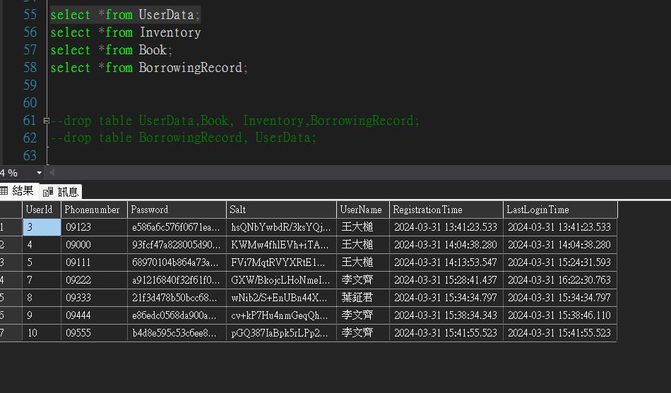
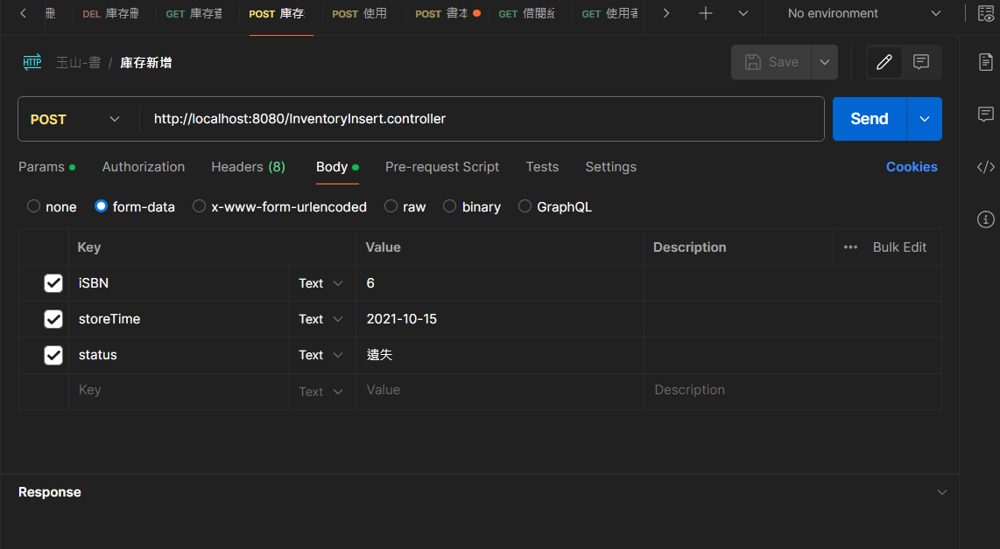
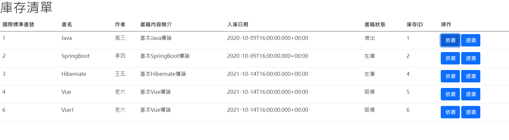
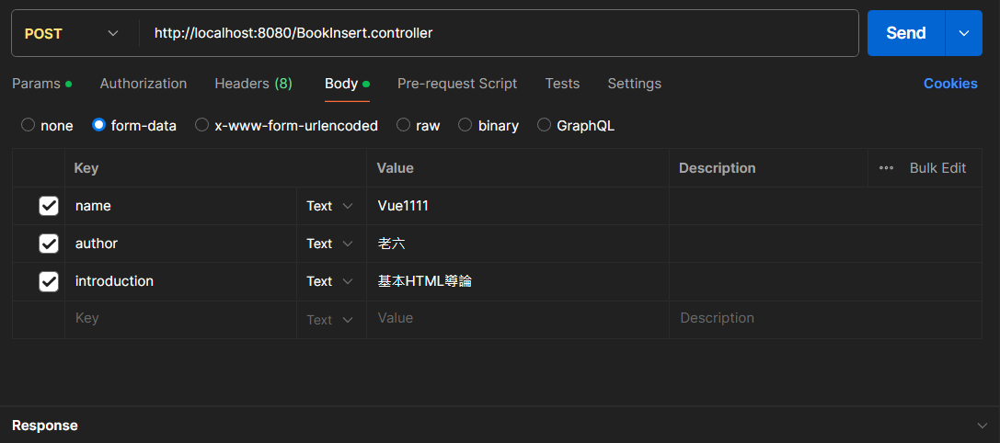

# SubBook
# 簡易線上圖書借閱系統

這是一個簡易的線上圖書借閱系統，使用者可以註冊會員、借閱書籍、管理書籍等功能。

## 使用方式

1. 請到 http://localhost:8080/BookIndex.html 進行登入。

2. 進行註冊會員時，系統會自動產生一個隨機的salt值，將註冊密碼和salt值結合後進行MD5 Hash加密，產生雜湊值用作密碼。具體原理註解可參見 `model/service/UserDataService`。

3. 註冊時間與登入時間會自動抓取，不需要輸入。

4. 借閱書籍時，系統會自動檢查書籍的狀態。如果書籍已被借出或者毀損，則無法借閱。成功借閱後，書籍狀態會相應更新，並新增一筆借閱紀錄，還書亦然。

5. 系統提供基本的書籍 CRUD 功能，可查詢全部關聯式資料表。
## 畫面截圖

### 註冊會員

### 庫存CRUD

### 借閱書籍

### 書籍管理

